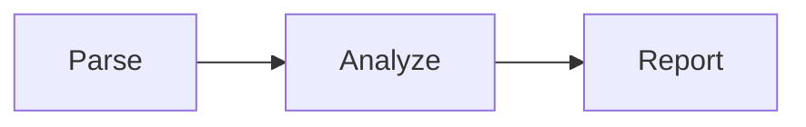

# **SlideGauge Comprehensive Test Suite**

This presentation demonstrates all SlideGauge features and rules

---

## ✅ Perfect Slide

This slide passes all checks:
- Clear title (under 35 chars)
- Moderate content (under 350 chars)
- Few bullets (under 6)
- Good line count (under 15)

**Score: 100**

---

## ❌ Problem: Title That Is Extremely Long And Exceeds The Maximum Allowed Character Limit

Short content here.

**Issue:** Title has 85 characters (max: 35)

---

This slide has no title at all, which is a critical error.

Some content here but missing the required heading.

**Issue:** Missing # or ## title

---

## ❌ Too Many Bullets Problem

This slide has way too many bullet points:
- First bullet point here
- Second bullet point here
- Third bullet point here
- Fourth bullet point here
- Fifth bullet point here
- Sixth bullet point here
- Seventh bullet point - exceeds limit!
- Eighth bullet point - way over!

**Issue:** 8 bullets > max 6

---

## ❌ Content Too Long

Lorem ipsum dolor sit amet, consectetur adipiscing elit. Sed do eiusmod tempor incididunt ut labore et dolore magna aliqua. Ut enim ad minim veniam, quis nostrud exercitation ullamco laboris nisi ut aliquip ex ea commodo consequat. Duis aute irure dolor in reprehenderit in voluptate velit esse cillum dolore eu fugiat nulla pariatur. Excepteur sint occaecat cupidatat non proident, sunt in culpa qui officia deserunt mollit anim id est laborum. Sed ut perspiciatis unde omnis iste natus error sit voluptatem accusantium.

**Issue:** Content exceeds 350 characters

---

## ❌ Too Many Lines

Line 1: Introduction to the topic
Line 2: First key point
Line 3: Second key point
Line 4: Third key point
Line 5: Supporting detail A
Line 6: Supporting detail B
Line 7: Supporting detail C
Line 8: Additional context
Line 9: More information
Line 10: Even more details
Line 11: Getting excessive now
Line 12: Still going
Line 13: Way too many
Line 14: Almost there
Line 15: Line 15 is the limit
Line 16: This line exceeds it!

**Issue:** 16 lines > max 15

---

## ❌ Accessibility: Missing Alt Text

Here's an image without alt text:


**Issue:** 2 images missing alt text

---

## ❌ Bare URLs Problem

Check out this link: https://example.com/documentation

Also see https://github.com/nibzard/slidegauge for the repo.

But this one is fine: [SlideGauge](https://github.com/nibzard/slidegauge)

**Issue:** 2 bare URLs not formatted as markdown links

---

## ❌ Low Contrast Colors

<span style="color: #aaaaaa">This text has low contrast on white background</span>

<span style="color: #cccccc">So does this light gray text</span>

<span style="color: #000000">This black text is fine</span>

**Issue:** Contrast ratio below WCAG AA standard (4.5:1)

---

## ❌ Too Many Colors

<span style="color: #FF0000">Red text</span>
<span style="color: #00FF00">Green text</span>
<span style="color: #0000FF">Blue text</span>
<span style="color: #FFFF00">Yellow text</span>
<span style="color: #FF00FF">Magenta text</span>
<span style="color: #00FFFF">Cyan text</span>
<span style="color: #FFA500">Orange text</span>
<span style="color: #800080">Purple text</span>

**Issue:** 8 unique colors > max 6

---

## ❌ Code Block Too Long

```python
# This Python code block is too long
def process_data(input_data):
    result = []
    for item in input_data:
        if item.is_valid():
            processed = item.transform()
            result.append(processed)
    return result

def another_function():
    pass
```

**Issue:** 11 lines of complex language code > max 5

---

## ❌ Simple Code Too Long

```bash
#!/bin/bash
echo "Line 1"
echo "Line 2"
echo "Line 3"
echo "Line 4"
echo "Line 5"
echo "Line 6"
echo "Line 7"
echo "Line 8"
echo "Line 9"
echo "Line 10"
echo "Line 11"
```

**Issue:** 12 lines of simple code > max 10

---

## ✅ Short Code Block (Good)

```python
def hello():
    print("Hello!")
```

This passes because it's only 3 lines.

---

## ✅ Table Example

Tables are weighted as special content:

| Feature | Status | Priority |
|---------|--------|----------|
| Title check | ✅ | High |
| Content limits | ✅ | High |
| Accessibility | ✅ | High |

**Note:** Each table row counts as 100 chars equivalent

---

## ✅ Mermaid Chart Example



**Note:** Chart lines count as 100 chars equivalent

---

## ❌ Content Too Short

Just a title and this sentence.

**Issue:** Less than 50 characters of content

---

## ✅ Exercise Slide (Extended Limits)

<div class="exercise">

**Your Task:** Fix the slides in this presentation

This is an exercise slide, so it gets extended content limits (450 chars instead of 350). This allows for more detailed instructions and examples without triggering the content length warning.

1. Identify slides with issues
2. Apply SlideGauge's suggestions
3. Re-run analysis to verify fixes
4. Aim for 100% passing rate

Remember: Good slides are concise, accessible, and clear!

</div>

---

## ❌ Multiple Issues Combined

This slide intentionally has multiple problems:
- Too many bullets (1)
- Too many bullets (2)
- Too many bullets (3)
- Too many bullets (4)
- Too many bullets (5)
- Too many bullets (6)
- Too many bullets (7)

And this content keeps going with more text to exceed the character limit. Lorem ipsum dolor sit amet, consectetur adipiscing elit. Sed do eiusmod tempor incididunt ut labore et dolore magna aliqua. Ut enim ad minim veniam, quis nostrud exercitation ullamco laboris nisi ut aliquip ex ea commodo consequat. Duis aute irure dolor in reprehenderit in voluptate velit.


Check out https://example.com for more.

**Issues:** bullets, content length, missing alt, bare URL

---

## Duplicate Title Test

First slide with this title.

---

## Duplicate Title Test

Second slide with the same title - triggers duplicate detection.

---

## Duplicate Title Test

Third slide with the same title - all three get flagged.

---

## ✅ Inline Rule Override

<!-- slidegauge: disable content/too_long -->

This slide has very long content but won't be flagged because we disabled the rule with an inline comment. Lorem ipsum dolor sit amet, consectetur adipiscing elit. Sed do eiusmod tempor incididunt ut labore et dolore magna aliqua. Ut enim ad minim veniam, quis nostrud exercitation ullamco laboris nisi ut aliquip ex ea commodo consequat. Duis aute irure dolor in reprehenderit in voluptate velit esse cillum dolore eu fugiat nulla pariatur.

**Note:** Rule override in comment

---

## ✅ Best Practices Summary

**What makes a great slide:**

✓ Clear, concise title (≤35 chars)
✓ Focused content (≤350 chars)
✓ Limited bullets (≤6)
✓ Scannable (≤15 lines)
✓ Accessible (alt text, contrast)
✓ Clean formatting (no bare URLs)

---

## Test Results Expected

**Expected scores:**
- Perfect slides: 100
- Minor issues: 85-95
- Multiple issues: 70-85
- Critical issues: <70

**Total slides:** 25
**Rules tested:** 11/11
**Features demonstrated:** All

---

## How to Use This Example

```bash
# Analyze this file
slidegauge example.md

# Get text summary
slidegauge example.md --text

# Get detailed JSON
slidegauge example.md --json

# Generate SARIF for CI/CD
slidegauge example.md --sarif
```

---

## Learn More

- **Repo:** https://github.com/nibzard/slidegauge
- **Issues:** Report bugs or request features
- **Contribute:** PRs welcome!

**Built for AI agents and humans alike** 🤖❤️
